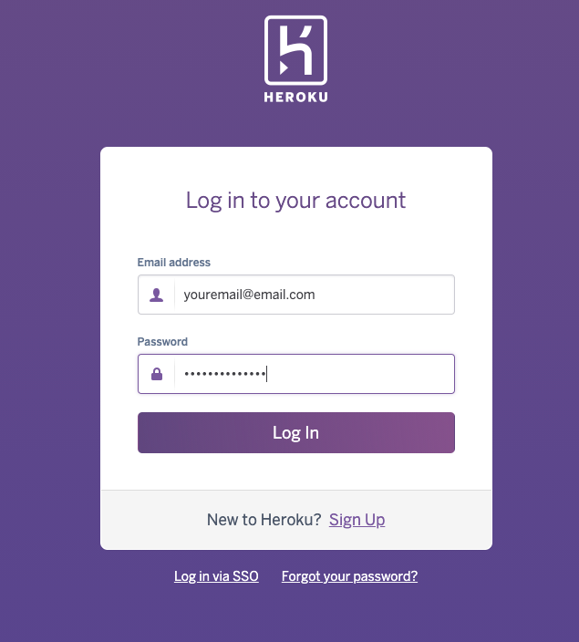
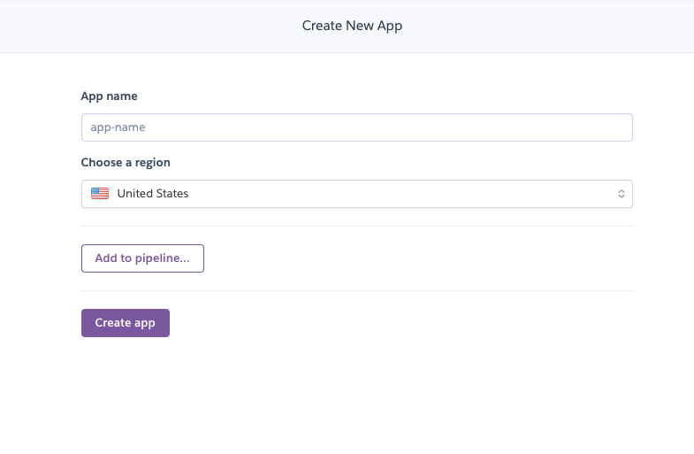
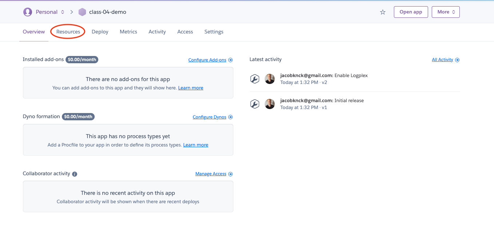

# Hosted Postgres Database: Heroku Postgres

When we deploy our applications we won't be able to access our local postgres database so we need to connect to a machine running Postgres in the cloud. This will allow us to always have a running instance of Postgres, with better hardware, more memory and faster network speeds. Heroku allows us to set up Postgres data directly through the Heroku CLI. Once set up, we can use a url much like we've been using to connect our application to our database.

1. Log Into your Heroku Account.  
   
1. Create / Update your Heroku Application.
   - If you haven't already, Create a Heroku Application.  
     
   - If your Heroku App is already created just select your App from the Dashboard.  
     
1. Add `Heroku Postgres` from the `Resources` tab from the Application View.
   
   - Type `Heroku Postgres` in the `Add-ons` section.  
     
   - After selecting the Add-on, Choose the `Hobby Dev-Free` plan and submit the form.
1. Confirm that you have an Environment Variable set for your Postgres Database.
   - Click on `Settings` from the Application View
     
   - Under the `Config Vars` you should see a field for `DATABASE_URL` with a postgres connection string as it's value.
     
1. Add your DATABASE_URL to your Application!
   - Make sure you are able to access environment specific variables within your source code.

```javascript
require("dotenv").config();

const POSTGRES_URI = process.env.DATABASE_URL;
```

> WARNING: Sequelize will require extra config for the `DATABASE_URL` make sure you use the following config object when you deploy:

```javascript
new Sequelize(DATABASE_URL, {
  dialectOptions: {
    ssl: {
      require: true,
      rejectUnauthorized: false,
    },
  },
});
```
